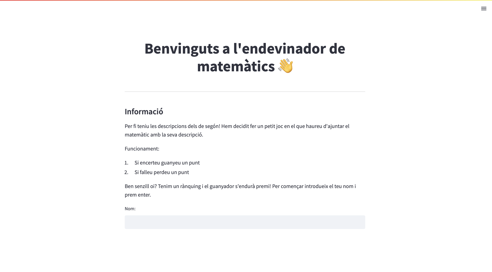
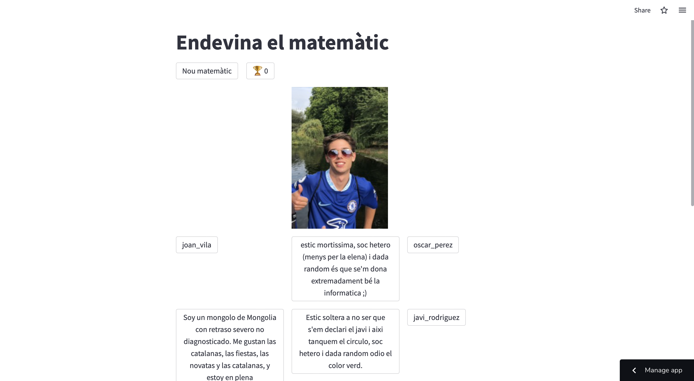
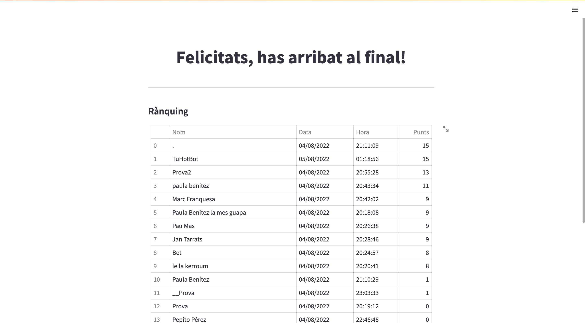
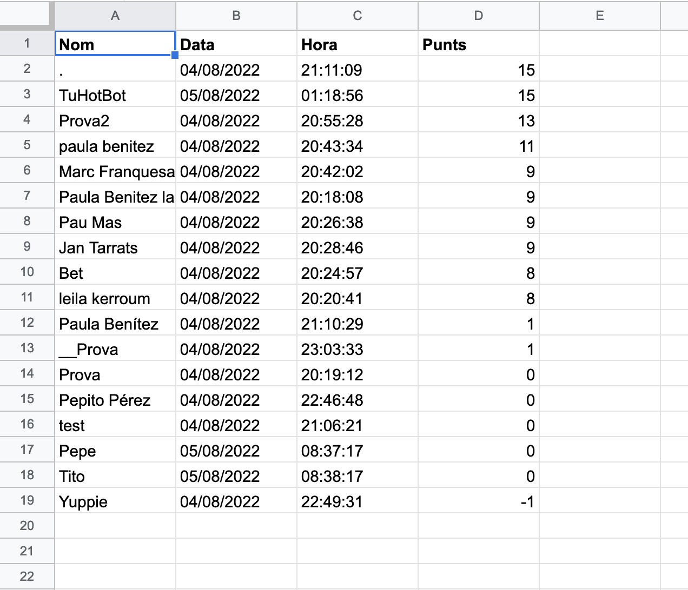

# app_novatos
[](https://maframo-app-novatos-test-main-9ylu8v.streamlitapp.com)

app_novatos is a web minigame built with Python and Streamlit to help first year students at FME get to know us a little better!

## Home page


## Game page


## Ranking page


## How to use it

This app uses a google worksheet as a database for the ranking. Here is an image of the format:



You will now need to enable the Sheets API and create a service account & key file. A local Streamlit app will read secrets from a file `.streamlit/secrets.toml` in your app's root directory. Create it and add the URL of your Google Sheet plus the content of the key file as shown below:

```
# .streamlit/secrets.toml

private_gsheets_url = "https://docs.google.com/spreadsheets/d/12345/edit?usp=sharing"

[gcp_service_account]
type = "service_account"
project_id = "xxx"
private_key_id = "xxx"
private_key = "xxx"
client_email = "xxx"
client_id = "xxx"
auth_uri = "https://accounts.google.com/o/oauth2/auth"
token_uri = "https://oauth2.googleapis.com/token"
auth_provider_x509_cert_url = "https://www.googleapis.com/oauth2/v1/certs"
client_x509_cert_url = "xxx"
```

Use the package manager [pip](https://pip.pypa.io/en/stable/) to install the requirements (remember to use a virtual environment).

```
pip install -r requirements.txt
```

You can now locally run it!

```
streamlit run main.py
```

Or you can skip everything here and click on the badge above to check it out!

## License
[MIT](https://choosealicense.com/licenses/mit/)